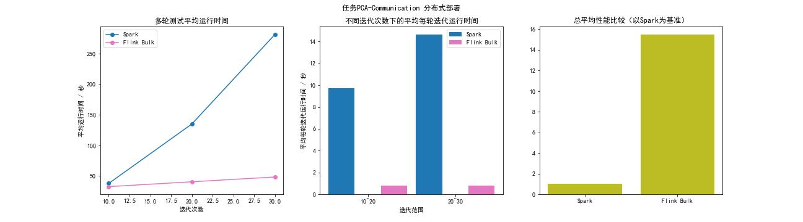

# **<center>《分布式编程模型与系统》期末考查作业</center>**

## 1	实验目的

比较 Spark 和 Flink 执行迭代应用的性能差异：

比较分别侧重于计算量、节点通信量等多种类型的作业中，Spark 执行迭代应用、Flink 使用 For 循环执行迭代应用、以及 Flink 使用迭代算子执行迭代应用中的性能差异。

---

## 2	设计思路

### 2.1 实验变量

a.	设计多个不同的作业，其计算量、占用内存量和节点通信量侧重各有不同。

b.	对比是否使用广播机制，从而调整各个实验中的节点通信量。

c.  依据数据在作业中是保存在数据集中还是公共变量中，来调整计算量和节点通信量。

d.  为了控制变量，每组实验中包括三个执行方式：Spark 利用 For 循环执行迭代应用、Flink 利用 For 循环执行迭代应用、Flink 利用迭代算子执行迭代应用。

### 2.2 编程思路

a. 由于批处理和流处理不具备可比性，而 Spark 只能进行批处理，因此 Flink 也使用了批处理类 DataSet 而非流处理类 DataStream。

b. 控制变量，尽量减少每个实验中无关变量的不同，比如实现相同的功能使用同样的处理逻辑和类似的算子、实现同一个方法时调用同一个外部库等。

### 2.3 观测指标

a.  为了排除框架本身其他操作耗时的干扰，作业的设计上尽量保证每轮迭代的计算量大致相同，这样可以用两次迭代次数不同的作业的耗时之差，来计算迭代计算过程中的真实耗时。

b.  通过迭代的单位耗时，来比较不同执行方式的性能差异。

### 2.4 预期结果

a. Spark 利用 For 循环执行迭代应用和Flink 利用 For 循环执行迭代应用的性能应当相仿。

b. Flink 利用迭代算子执行迭代应用的性能应当明显高于Flink 利用 For 循环执行迭代应用。

c. 对高计算量、占用内存量大、高通信的作业，预期结果 b 会更明显。

d. 相比于单机集中式部署，分布式部署的预期结果 b 会更明显。

---

## 3	实验设置

### 3.1 实验环境

本实验分为单机集中式部署和分布式部署。

#### 单机集中式部署环境（IDEA调试）

- 硬件：CPU: Intel i5-1135G7 四核八线程
- 操作系统：Windows 10 21H1 64位
- hadoop:
  - 版本：2.5.1
- Spark：
  - 版本：2.3.2
  - 最大内存：4096 MB
- Flink：
  - 版本：1.6.2
  - 最大内存：4096 MB


#### 分布式部署环境

- 节点个数：1个主节点、2个从节点、1个客户端
- 硬件：CPU: Intel Core Processor (Haswell, no TSX) 二核二线程
- 操作系统：Ubuntu 18.04.3 LTS 64位
- hadoop:
  - 版本：2.10.1
- Spark：
  - 版本：2.4.7
  - 最大内存 2048 MB
  - 使用 Client 提交
- Flink：
  - 版本：1.12.1
  - 最大内存 2048 MB
  - 使用 Attached 提交

*Spark 和 Flink 均基于 Yarn 部署*

### 3.2 实验数据

数据集：MNIST手写数字数据集（取其中4096个样本进行实验），该数据集中每个样本是一个 28\*28 的矩阵，代表了一张 28\*28 像素的手写数字灰度图。同时，每个样本有一个在 0~9 之间的标签。

---

## 4	实验过程

设计了三个不同的作业：矩阵主成分分析（PCA）、K均值聚类（Kmeans）、多层感知器（MLP），分别使用 Spark 利用 For 循环执行、使用 Flink 利用 For 循环执行、使用 Flink 利用迭代算子（BulkIteration）执行。

每个试验都循环进行 5 次（另有 Warm up 轮），取均值作为实验结果。

通过命令参数传入进行的作业，运行的方式，执行的迭代次数，数据集的路径等。

命令示例：
```
./spark-2.4.7/bin/spark-submit 
  --packages gov.nist.math:jama:1.0.2,net.sourceforge.javacsv:javacsv:2.0 
  --deploy-mode client 
  --master yarn 
  --class cn.edu.ecnu.finallab.Run ./finalLab/FinalLab.jar 
  PCA spark vanilla 15 ./finalLab/mnist-images.csv 
  ./finalLab/mnist-labels.csv 2 5 
  > result.txt
```


### 4.1 PCA

主成分分析利用降维的思想，把多指标转化为少数几个综合指标。

在本实验中，我们对图像矩阵进行分解并提取主成分，然后使用主成分重构矩阵，最后计算原矩阵和重构矩阵间的均方根误差（RMSE）。同时也可以用于验证不同方式执行结果的正确性。

由于内部实现可能不同，为了控制变量，使用的矩阵类为 Jama 包的 Matrix 类而非 spark 内置的矩阵类，基于 Jama 包的提供的函数实现了 PCA。

#### 4.1.1 Vanilla 版本

##### 执行内容

<!-- ```mermaid
flowchart LR
  subgraph A[sub1]
   	begin(map) -> buy(reduce)
  end

  subgraph B[sub2]
   	begin2(map) -> buy2(reduce)
  end

  A -> B
```
*DAG* -->

- Vanilla 版本对 Tuple3<Integer, Matrix, Double> 数据进行循环。
- 元组中的内容分别为迭代轮数、上一轮迭代计算的重构矩阵、上一轮迭代原矩阵和重构矩阵的均方根误差。
- 在每一轮迭代中，依据迭代轮数确定保留主成分的比例，将上一轮的重构矩阵作为原矩阵进行主成分分析，计算其与新的重构矩阵间的均方根误差，输出到下一轮。


*RDD Lineage (Flink类似)*
  
##### 逻辑特点

- 计算量较小，使用较大的迭代轮数，几乎没有节点间通信。

##### 运行结果

1. 单机集中式


2. 分布式


  *\*本报告所有详细运行结果见附表*

##### 结果分析

- 由于运行时间随迭代次数基本成正比上升，可以推测保证了每轮迭代计算量相同且不存在某轮迭代开始性能达到瓶颈。
- 在集中式部署下，使用 For 循环进行迭代的 Spark 和 Flink 性能大致相等，而使用迭代算子的 Flink 性能很高。
- 在分布式部署下，使用 For 循环进行迭代的 Flink 迭代性能略高于 Spark，而总运行时间可能因框架原因非常长。而使用迭代算子的 Flink 性能远差于前二者。

#### 4.1.1 Communication 版本

##### 执行内容

- Communication 版本的迭代数据和 Vanilla 版本相同。
- 在每一轮迭代中，Communication 版本除了计算每个元组的重构矩阵和均方根误差，还将所有数据的均方根误差求和并输出。
- 这样增加了节点之间的通信量。


<center>*RDD Lineage (Flink类似)*</center>
  
##### 逻辑特点

- 计算量中等，使用适当的迭代轮数，有一定的节点间通信。

##### 运行结果

**注**：由于在该情形的分布式部署下使用 For 迭代的 Flink 会在每一轮迭代都提交一个 Job，因此结果非常大且不具可比性，因此分布式部署时仅对 Spark 和使用迭代算子的 Flink 进行比较。

1. 单机集中式
   


2. 分布式



##### 结果分析 

- 使用 For 循环进行迭代时，Spark 和 Flink 都发生了迭代次数越多、每轮迭代耗时越多的情况，其中 Flink 的情况更严重。每轮迭代计算量是相同的，查看系统资源后发现是内存被占满，可用内存越来越少。
- 但使用迭代算子时，Flink 每轮迭代时间基本不变，而且效率远高于 For 循环。

#### 小结

- 对简单的迭代计算任务，使用 Spark 和 Flink 使用 For 循环进行迭代的性能相仿。
- 对要产生大量节点间通信数据和具有高计算量的任务，使用 For 循环进行迭代很容易占用过多内存、作业效率大幅度降低，而 Flink 的迭代算子可以很好地进行内存管理，运行高效。

### 4.2 K-means

K 均值聚类算法（K-means）是一种迭代求解的聚类算法，其步骤是，首先随机选取 K 个样本作为初始的聚类中心，然后把每个样本分配给距离它最近的聚类中心，接着计算聚类样本的平均坐标作为聚类的聚类中心，反复迭代这个过程直到满足终止条件。本实验的终止条件即为达到计划迭代次数。

该任务对手写数字灰度图矩阵进行聚类，预测图片所属的类别，最后将预测结果汇总成可能性矩阵，计算纯度，衡量聚类的有效性。同时也可以用于验证不同方式执行结果的正确性。

该任务没有调用其他的数学或机器学习库。

#### 4.2.1 Vanilla 版本

##### 执行内容

- Vanilla 版本对 Centroid 数据进行循环，其中记录了所有的聚类中心。
- 在每一轮迭代中，将 Centroid 数据广播到各个节点中，然后对 Point 数据进行处理（其中记录了所有点的信息），寻找最近的聚类中心，求每一个类所有点的坐标和，然后计算新的聚类中心组成 Centroid 数据，输出到下一轮。


<center>*RDD Lineage (Flink类似)*</center>

##### 逻辑特点

- 计算量中等，使用适当的迭代轮数，节点通信较少，表现为广播机制

##### 运行结果

1. 单机集中式
   


1. 分布式


###### 结果分析

- 分布式部署时，呈现了明显的运行效率: 迭代算子 Flink > For 循环 Flink > For 循环 Spark。
- 但单机集中式部署时，使用 For 循环的 Flink 的执行效率反超迭代算子。
- 虽然 For 循环 Flink 的效率高于 Spark，但 Spark 的效率随迭代增加而有所提高。可能是广播机制的不同导致的。


#### 4.2.2 Communication 版本

##### 执行内容

- Communication 版本相比较于 Vanilla 版本，执行的不同之处在于每轮迭代找到新的聚类中心后，都将预测结果汇总成可能性矩阵并计算纯度。
- 这样大大增加了通信量和计算量。


<center>*RDD Lineage (Flink类似)*</center>

##### 逻辑特点

- 计算量较大，使用适当的迭代轮数，节点通信较多，每轮都汇总了可能性矩阵

##### 运行结果
  
**注**：由于在该情形的分布式部署下使用 For 迭代的 Flink 会在每一轮迭代都提交一个 Job，因此结果非常大且不具可比性，因此分布式部署时仅对 Spark 和使用迭代算子的 Flink 进行比较。

1. 单机集中式


2. 分布式


##### 结果分析

- 可以明显看到，内存管理能力较差的使用 For 循环迭代的 Flink 发生了内存不足的情况，另外二者每轮迭代的平均耗时基本不变。
- 使用迭代算子的 Flink 的运行效率远高于使用 For 循环迭代的 Spark.

#### 4.2.3 No-broadcast 版本

##### 执行内容

- No-broadcast 版本相比较于 Vanilla 版本，增加了通信量：
  - Spark 执行上，删去了 Centroid 数据的广播机制；
  - Flink 由于无法传全局变量，于是每轮迭代将 Centroid 进行一次 Collect，然后还原到 Dataset 中重新广播。
  - 使用了迭代算子的 Flink 无法修改未结束的 IterativeDataSet 对象，不能 Collect 后重新广播，因此使用了一个 Reduce 算子来增加通信量。

- 由于三者使用了不同方法来增加通信量，不适宜横向比较，只能与各自的 Vanilla 版本进行纵向比较。

*RDD Lineage略*

##### 逻辑特点

- 计算量中等，使用适当的迭代轮数，节点通信较多

##### 运行结果

**注**：由于在该情形的分布式部署下使用 For 迭代的 Flink 会在每一轮迭代都提交一个 Job，因此结果非常大且不具可比性，因此分布式部署时仅对 Spark 和使用迭代算子的 Flink 进行比较。

1. 单机集中式


2. 分布式


##### 结果分析

- 与 Vanilla 版本相比，单机部署下使用 For 循环迭代的 Flink 和 Spark 均发生了内存不足的情况，但分布式下的 Spark 随迭代增加效率反而有所增加。


#### 小结

- Flink 在使用 For 循环迭代时，对高计算量的内存管理表现较差，但优秀的广播机制使其在单机集中情况下表现突出。
- Spark 在没有广播机制的情况下，可能通过一定的缓存机制，进行运行的优化，使每轮迭代时间逐渐下降。
- 使用 Flink 的迭代算子进行迭代操作在分布式一直表现优越，在单机集中式时也往往表现良好。


### 4.3 MLP

MLP，即多层感知机，也叫人工神经网络，是一种全连接的神经网络。 MLP 包括输入层，若干个隐藏层，以及输出层，其中层与层之间都是全连接的，因此该网络参数量大，计算代价高，往往设计得较浅。

本实验实现了一个具有单层隐藏层的 MLP ，对手写数字灰度图进行 10 分类。为了消除使用的库不同、优化程度不同带来的误差，本实验中没有调用 spark 和 flink 内置的深度学习库，而是手动实现了 Linear 层，Relu 层，Softmax 层，Log 层，Batch Normalization 层等网络结构的前向计算和反向传播方法。（其中 MLP 本来没有 BatchNorm 层，但 java 的浮点数表示范围有限，极容易发生梯度消失和梯度爆炸，运算结果中出现 NaN 或者 Inf，因此使用 BatchNorm 层防止其发生。）

本实验将数据按批大小分为多个 Batch，对同一个 MLP 对象的参数进行迭代优化，并与真实标签对比，计算损失值和准确率。同时也可以用于验证不同方式执行结果的正确性。

由于在使用迭代算子的 flink 中，迭代的数据都是复制的新的对象，而且广播变量也是只读的，无法让所有 Task 对同一个 MLP 对象进行更新，因此只在使用 For 循环迭代的 spark 和 flink 中进行实验。


#### 4.2.1 Vanilla 版本

##### 执行内容

- Vanilla 版本对 Tuple2\<MLP, ArrayList\<ArrayList\<ArrayList\<Double>>>> 数据进行循环。其中第一个元素是自定义的 MLP 对象，其中保存了训练过程中产生的 cache，并实现了前向计算和反向传播的方法。第二个元素的数组内保存了图像矩阵、真实标签和预测得分，以 batch 的形式保存在数组中。
- 所有数据都指向同一个 MLP 对象。在每一轮迭代中，任务对每个 batch 进行预测，然后使用真实标签矩阵进行优化，最后更新参数，输出到下一轮。
- 训练结束后，计算最终模型的 Loss 值和准确率，并汇总求均值。


*RDD Lineage (Flink类似)*

##### 逻辑特点

- 计算量较小，使用较多的迭代轮数，节点通信较少，主要表现在从节点更新保存在任务主节点上的 MLP 模型的参数。

##### 运行结果

1. 单机集中式


2. 分布式


##### 结果分析

- 对计算量较小、通信量也较小的任务，使用 For 循环迭代的 Spark 和 Flink 的每轮迭代运行效率基本相等。
- 推测由于框架原因，分布式部署时总时间上 Flink 执行的时间更长一些。


#### 4.2.2 Communication 版本

##### 执行内容

- Communication 版本相比较于 Vanilla 版本，执行的不同之处在于每轮迭代后都计算一次最终模型的 Loss 值和准确率，并汇总求均值。
- 这样大大增加了通信量和计算量。


*RDD Lineage (Flink类似)*

##### 逻辑特点

- 计算量较大，使用适当的迭代轮数，节点通信较多，每轮都计算和汇总了 Loos 值和准确率。

##### 运行结果

**注**：由于在该情形的分布式部署下使用 For 迭代的 Flink 会在每一轮迭代都提交一个 Job，因此结果非常大且不具可比性，因此分布式部署时不测试该情形。


1. 单机集中式


2. 分布式


##### 结果分析

- 对于这种内存占用小的任务，虽然增加大量通信量和计算量，但仍未达到性能瓶颈。虽然每轮迭代需要花费很长的时间，但没有特别明显的效率下降。


#### 小结

- 当没有达到性能瓶颈时，无论节点间通信量和计算量大小，使用 For 循环执行 Spark 和 Flink 的效率基本相同。

---


## 5	结论
<!-- 实验过程中，观察到的现象是否符合预期。如果不符合预期，可能的原因是什么。 -->

- **简单迭代任务**
  - **结论**：Flink 使用批式迭代计算的性能非常好，Spark 和 Flink 使用 For 循环迭代的性能基本相同。
  - **实验支撑**：在 PCA-Vanilla、Kmeans-Vanilla 实验中，使用迭代算子的 Flink 执行效率最高，其他二者基本相同。
  - **理论依据**：Flink 具有专门的迭代算子和迭代流程，对迭代自动优化，也有高效的容错机制。

- **高内存任务**
  - **结论**：Flink 使用批式迭代计算有高效的内存使用机制，有效回收内存，避免内存不足带来的效率低下。另外二者容易发生内存不足的情况，但相比之下 Spark 使用 For 循环迭代的内存管理能力比 Flink 使用 For 循环迭代略微更强一些。
  - **实验支撑**：在高内存使用的 PCA-Communication、Kmeans-No-Broadcast 实验中，两个框架使用 For 循环运行都发生了内存不足的情况；在 Kmeans-Communication 实验中，只有使用 For 循环迭代的 Flink 发生了这种情况。
  - **理论依据**：
    - Flink 专门的迭代算子可以灵活的对迭代中需要更新的数据进行管理，合理使用内存，在迭代任务中表现最佳。
    - Spark 的统一内存管理机制，与静态内存管理机制的区别在于存储内存和执行内存共享同一块空间，可以动态占用对方的空闲区域，内存管理能力较强。
    - Flink将对象都序列化到一个预分配的内存块上，提供了非常高效的读写方法，如果需要处理的数据多于可以保存在内存中的数据，Flink的运算会将部分数据溢出到磁盘，但读写效率就会大打折扣。

- **高节点间通信任务**
  - **结论**：对通信内容较多的任务，Flink 使用批式迭代计算效率仍最高，Spark 效率最低。但当通信内容大部分冗余不变时，Spark 的效率随迭代次数增加逐渐提升。
  - **实验支撑**：在 Kmeans-No-Broadcast 实验中，由于聚类中心点随迭代次数增加逐渐收敛，归类于该聚类的点也很少发生变化，没有使用广播机制的 Spark 的效率也逐渐上升。在 Kmeans-Vanilla 的单机集中式部署中，使用了广播机制、通信较少的 For 循环迭代的 Flink 反而效率最高。
  - **理论依据**：Kmeans 任务的通信主要在于聚类中心数据，每轮迭代中间步骤时聚类中心数据都是不变的，因此可以使用广播机制将数据发送到节点而非 Task，减少内存开销。Flink 使用迭代数据外的数据时要求使用广播机制，效率很高。Spark 不使用广播机制时，虽然没有在代码中实现 cache ，但有可能是系统的缓存机制逐渐提高了效率。

- **高计算量任务**
  - **结论**：当内存等资源不受限制，通信量基本相同时，使用 For 循环的 Spark 和 Flink 效率基本相同。
  - **实验支撑**：在 MLP-Vanilla 和 MLP-Communication 实验中，二者的每轮迭代时间都基本相同。
  - **理论依据**：使用 For 循环执行迭代时，二者都没有从迭代本身进行优化。

综上所述，在分布式部署情况下，无论遇到何种特点的任务，如果涉及到批式迭代计算，使用 Flink 的批式迭代操作进行进行计算是最高效的，而应避免使用 Spark 或 Flink 进行 For 循环迭代。
（在实际应用中不考虑集中式部署，这种情况下不需要使用分布式计算框架）

## 6    附表
- **PCA-Vanilla-单机集中式**
  
| 迭代15次 | Warm Up 轮数 | 第1轮 | 第2轮 | 第3轮 | 第4轮 | 第5轮 | 平均值 | 
| :-: | :-: | :-: | :-: | :-: | :-: | :-: | :-: |
| spark | 2 | 4.836  | 4.854  | 4.837  | 4.865  | 4.926  | 4.863 |
| flink | 2 | 5.108  | 5.092  | 5.053  | 5.081  | 5.109  | 5.088 | 
| flink-bulk | 2 | 4.250  | 4.522  | 4.231  | 4.542  | 4.560  | 4.421 |

| 迭代30次 | Warm Up 轮数 | 第1轮 | 第2轮 | 第3轮 | 第4轮 | 第5轮 | 平均值 | 
| :-: | :-: | :-: | :-: | :-: | :-: | :-: | :-: |
| spark | 2 | 9.672  | 9.554  | 9.553  | 9.546  | 9.466  | 9.558 |
| flink | 2 | 9.733  | 9.680  | 9.584  | 9.605  | 9.550  | 9.630 |
| flink-bulk | 2 | 7.251  | 7.229  | 7.061  | 7.222  | 7.220  | 7.196 |

| 迭代45次 | Warm Up 轮数 | 第1轮 | 第2轮 | 第3轮 | 第4轮 | 第5轮 | 平均值 | 
| :-: | :-: | :-: | :-: | :-: | :-: | :-: | :-: |
| spark | 2 | 14.373  | 14.468  | 14.244  | 14.314  | 14.519  | 14.383 |
| flink | 2 | 14.022  | 13.757  | 14.175  | 13.952  | 13.991  | 13.979 |
| flink-bulk | 2 | 10.149  | 9.968  | 10.172  | 10.217  | 10.177  | 10.136 |


- **PCA-Vanilla-分布式**
  
| 迭代15次 | Warm Up 轮数 | 第1轮 | 第2轮 | 第3轮 | 第4轮 | 第5轮 | 平均值 | 
| :-: | :-: | :-: | :-: | :-: | :-: | :-: | :-: |
| spark | 2 | 9.163  |  8.766  |  9.611  |  8.519  |  8.607  | 8.933 |
| flink | 2 |  31.921  |  31.139  |  28.395  |  29.832  |  29.426  | 30.142 |
| flink-bulk | 2 | 33.623  |  33.552  |  34.339  |  33.188  |  35.905  | 34.121 |

| 迭代30次 | Warm Up 轮数 | 第1轮 | 第2轮 | 第3轮 | 第4轮 | 第5轮 | 平均值 | 
| :-: | :-: | :-: | :-: | :-: | :-: | :-: | :-: |
| spark | 2 | 17.729  |  17.218  |  17.689  |  18.290  |  18.294  | 17.844 |
| flink | 2 | 37.678  |  37.699  |  36.864  |  39.432  |  37.804  | 37.895 |
| flink-bulk | 2 | 45.827  |  45.317  |  45.383  |  45.387  |  46.29  | 45.640 |

| 迭代45次 | Warm Up 轮数 | 第1轮 | 第2轮 | 第3轮 | 第4轮 | 第5轮 | 平均值 | 
| :-: | :-: | :-: | :-: | :-: | :-: | :-: | :-: |
| spark | 2 | 26.046  |  26.085  |  25.894  |  25.572  |  25.556  | 25.830 |
| flink | 2 | 45.077  |  45.927  |  44.991  |  43.807  |  45.367  | 45.033 |
| flink-bulk | 2 | 55.494  |  57.421  |  55.306  |  57.426  |  55.869  |  56.303 |


- **PCA-Communication-单机集中式**
  
| 迭代10次 | Warm Up 轮数 | 第1轮 | 第2轮 | 第3轮 | 第4轮 | 第5轮 | 平均值 | 
| :-: | :-: | :-: | :-: | :-: | :-: | :-: | :-: |
| spark | 2 | 20.925  |  21.118  |  21.014  |  21.524  |  20.892  | 21.094 |
| flink | 2 | 27.695  |  27.989  |  27.864  |  28.152  |  27.854  | 27.910 |
| flink-bulk | 2 | 18.330  |  18.465  |  15.918  |  15.765  |  15.842  | 16.864 |

| 迭代20次 | Warm Up 轮数 | 第1轮 | 第2轮 | 第3轮 | 第4轮 | 第5轮 | 平均值 | 
| :-: | :-: | :-: | :-: | :-: | :-: | :-: | :-: |
| spark | 2 | 63.001  |  62.730  |  62.837  |  62.843  |  62.649  | 62.812 |
| flink | 2 | 81.143  |  81.103  |  80.713  |  81.168  |  81.597  | 81.144  |
| flink-bulk | 2 | 33.876  |  29.131  |  29.397  |  28.991  |  29.086  | 30.096 |

*\*迭代前8次耗时很短，因此出现迭代20次的时间远超过迭代10次的2倍*

| 迭代30次 | Warm Up 轮数 | 第1轮 | 第2轮 | 第3轮 | 第4轮 | 第5轮 | 平均值 | 
| :-: | :-: | :-: | :-: | :-: | :-: | :-: | :-: |
| spark | 2 | 135.962  |  135.952  |  135.484  |  135.849  |  138.658  | 136.381 |
| flink | 2 | 202.678  |  202.229  |  200.593  |  200.099  |  203.249  | 201.769 |
| flink-bulk | 2 | 41.739  |  42.293  |  42.796  |  42.683  |  43.108  | 42.523 |


- **PCA-Communication-分布式**
  
| 迭代10次 | Warm Up 轮数 | 第1轮 | 第2轮 | 第3轮 | 第4轮 | 第5轮 | 平均值 | 
| :-: | :-: | :-: | :-: | :-: | :-: | :-: | :-: |
| spark | 2 | 38.212  |  38.634  |  37.651  |  37.556  |  37.360  | 37.882 |
| flink-bulk | 2 | 32.644  |  32.529  |  32.294  |  33.143  |  32.767  | 32.675 |

| 迭代20次 | Warm Up 轮数 | 第1轮 | 第2轮 | 第3轮 | 第4轮 | 第5轮 | 平均值 | 
| :-: | :-: | :-: | :-: | :-: | :-: | :-: | :-: |
| spark | 2 | 133.761  |  136.594  |  134.876  |  135.862  |  133.511  | 134.920 |
| flink-bulk | 2 | 40.638  |  40.296  |  41.544  |  39.299  |  41.154  | 40.586 |

*\*spark迭代前8次耗时很短，因此出现迭代20次的时间远超过迭代10次的2倍*

| 迭代30次 | Warm Up 轮数 | 第1轮 | 第2轮 | 第3轮 | 第4轮 | 第5轮 | 平均值 | 
| :-: | :-: | :-: | :-: | :-: | :-: | :-: | :-: |
| spark | 2 |  281.580  |  279.652  |  282.177  |  282.518  |  280.674  |  281.320 |
| flink-bulk | 2 | 46.835  |  49.652  |  47.508  |  50.19  |  47.949  |  48.426 |


---


- **Kmeans-Vanilla-单机集中式**
  
| 迭代10次 | Warm Up 轮数 | 第1轮 | 第2轮 | 第3轮 | 第4轮 | 第5轮 | 平均值 | 
| :-: | :-: | :-: | :-: | :-: | :-: | :-: | :-: |
| spark | 2 | 23.165  |  23.754  |  23.447  |  23.433  |  21.400  | 23.039 |
| flink | 2 | 7.194  |  7.283  |  7.100  |  7.072  |  7.513  | 7.232 |
| flink-bulk | 2 | 16.049  |  17.088  |  15.12  |  16.112  |  15.136  | 15.901 |

| 迭代20次 | Warm Up 轮数 | 第1轮 | 第2轮 | 第3轮 | 第4轮 | 第5轮 | 平均值 | 
| :-: | :-: | :-: | :-: | :-: | :-: | :-: | :-: |
| spark | 2 | 42.576  |  42.643  |  43.520  |  41.531  |  44.953  | 43.044 |
| flink | 2 | 13.662  |  13.092  |  13.386  |  13.033  |  13.127  | 13.260 |
| flink-bulk | 2 | 28.61  |  27.624  |  29.871  |  28.581  |  29.198  | 28.776 |

| 迭代30次 | Warm Up 轮数 | 第1轮 | 第2轮 | 第3轮 | 第4轮 | 第5轮 | 平均值 | 
| :-: | :-: | :-: | :-: | :-: | :-: | :-: | :-: |
| spark | 2 | 59.157  |  58.963  |  59.002  |  59.936  |  59.366  | 59.284 |
| flink | 2 | 19.649  |  19.472  |  19.450  |  19.600  |  19.646  | 19.563 |
| flink-bulk | 2 | 40.520  |  40.521  |  42.108  |  41.187  |  43.467  |  41.560 |


- **Kmeans-Vanilla-分布式**
  
| 迭代10次 | Warm Up 轮数 | 第1轮 | 第2轮 | 第3轮 | 第4轮 | 第5轮 | 平均值 | 
| :-: | :-: | :-: | :-: | :-: | :-: | :-: | :-: |
| spark | 2 | 37.894  |  40.883  |  41.342  |  42.066  |  41.021  | 40.641 |
| flink | 2 | 40.248  |  40.718  |  41.407  |  41.031  |  40.943  | 40.869 |
| flink-bulk | 2 | 38.405  |  38.738  |  38.469  |  37.301  |  40.456  | 38.673 |

| 迭代20次 | Warm Up 轮数 | 第1轮 | 第2轮 | 第3轮 | 第4轮 | 第5轮 | 平均值 | 
| :-: | :-: | :-: | :-: | :-: | :-: | :-: | :-: |
| spark | 2 |  77.570  |  76.932  |  76.376  |  77.528  |  78.293  |  77.339  |
| flink | 2 | 63.708  |  61.869  |  62.654  |  67.263  |  66.541  |  64.407 |
| flink-bulk | 2 | 50.642  |  48.98  |  50.067  |  51.196  |  52.188  |50.614 |

| 迭代30次 | Warm Up 轮数 | 第1轮 | 第2轮 | 第3轮 | 第4轮 | 第5轮 | 平均值 | 
| :-: | :-: | :-: | :-: | :-: | :-: | :-: | :-: |
| spark | 2 | 106.238  |  105.087  |  104.005  |  104.92  |  107.681  | 105.586 |
| flink | 2 | 85.889  |  83.058  |  81.947  |  85.31  |  84.028  | 84.046 |
| flink-bulk | 2 | 61.569  |  63.105  |  62.194  |  63.64  |  63.163  |  62.734 |


- **Kmeans-Communication-单机集中式**
  
| 迭代10次 | Warm Up 轮数 | 第1轮 | 第2轮 | 第3轮 | 第4轮 | 第5轮 | 平均值 | 
| :-: | :-: | :-: | :-: | :-: | :-: | :-: | :-: |
| spark | 2 | 38.419  |  38.579  |  38.664  |  38.353  |  39.645  | 38.732 |
| flink | 2 | 46.626  |  46.886  |  46.302  |  45.935  |  46.616  | 46.473 |
| flink-bulk | 2 | 16.526  |  16.628  |  15.810  |  16.922  |  16.888  | 16.554 |

| 迭代20次 | Warm Up 轮数 | 第1轮 | 第2轮 | 第3轮 | 第4轮 | 第5轮 | 平均值 | 
| :-: | :-: | :-: | :-: | :-: | :-: | :-: | :-: |
| spark | 2 | 81.660  |  81.144  |  82.234  |  79.274  |  73.508  | 79.564 |
| flink | 2 | 140.662  |  144.971  |  141.830  |  149.731  |  148.187  |145.076|
| flink-bulk | 2 | 30.945  |  31.552  |  32.409  |  31.693  |  30.649  |  31.449 |

| 迭代30次 | Warm Up 轮数 | 第1轮 | 第2轮 | 第3轮 | 第4轮 | 第5轮 | 平均值 | 
| :-: | :-: | :-: | :-: | :-: | :-: | :-: | :-: |
| spark | 2 | 111.190  |  111.065  |  112.705  |  114.786  |  110.522  | 112.053 |
| flink | 2 | 311.786  |  311.262  |  310.650  |  313.494  |  312.175 | 311.873 |   
| flink-bulk | 2 | 45.698  |  46.958  |  45.450  |  47.985  |  47.059  |  46.630 |


- **Kmeans-Communication-分布式**
  
| 迭代10次 | Warm Up 轮数 | 第1轮 | 第2轮 | 第3轮 | 第4轮 | 第5轮 | 平均值 | 
| :-: | :-: | :-: | :-: | :-: | :-: | :-: | :-: |
| spark | 2 | 79.101  |  80.562  |  76.186  |  76.79  |  76.942  | 77.916 |
| flink-bulk | 2 | 43.211  |  42.543  |  43.462  |  41.234  |  43.345  | 42.759 |

| 迭代20次 | Warm Up 轮数 | 第1轮 | 第2轮 | 第3轮 | 第4轮 | 第5轮 | 平均值 | 
| :-: | :-: | :-: | :-: | :-: | :-: | :-: | :-: |
| spark | 2 |  135.890  |  134.610  |  134.510 |  134.255  |  134.056  |  134.664  |
| flink-bulk | 2 | 56.624  |  54.737  |  56.594  |  57.029  |  57.183  | 56.433 |

| 迭代30次 | Warm Up 轮数 | 第1轮 | 第2轮 | 第3轮 | 第4轮 | 第5轮 | 平均值 | 
| :-: | :-: | :-: | :-: | :-: | :-: | :-: | :-: |
| spark | 2 |  195.560  |  194.395  |  194.448  |  194.165  |  194.013  | 194.516  |
| flink-bulk | 2 | 70.655  |  69.482  |  71.205  |  70.878  |  74.931  |  71.430 |


- **Kmeans-No-broadcast-单机集中式**
  
| 迭代10次 | Warm Up 轮数 | 第1轮 | 第2轮 | 第3轮 | 第4轮 | 第5轮 | 平均值 | 
| :-: | :-: | :-: | :-: | :-: | :-: | :-: | :-: |
| spark | 2 | 22.520  |  24.06  |  22.204  |  23.031  |  21.767  | 22.716 |
| flink | 2 | 20.144  |  19.935  |  20.228  |  20.103  |  19.977  | 20.077 |
| flink-bulk | 2 | 15.323  |  20.824  |  19.548  |  17.534  |  14.722  | 17.590 |

| 迭代20次 | Warm Up 轮数 | 第1轮 | 第2轮 | 第3轮 | 第4轮 | 第5轮 | 平均值 | 
| :-: | :-: | :-: | :-: | :-: | :-: | :-: | :-: |
| spark | 2 | 44.190  |  45.528  |  47.915  |  45.059  |  41.505  | 44.839 |
| flink | 2 | 47.789  |  40.072  |  44.436  |  45.490  |  41.970  | 43.951 |
| flink-bulk | 2 | 33.569  |  30.337  |  30.545  |  34.609  |  33.721  | 32.556 |

| 迭代30次 | Warm Up 轮数 | 第1轮 | 第2轮 | 第3轮 | 第4轮 | 第5轮 | 平均值 | 
| :-: | :-: | :-: | :-: | :-: | :-: | :-: | :-: |
| spark | 2 | 79.389  |  77.191  |  75.497  |  77.469  |  77.216  | 77.352 |
| flink | 2 | 90.094  |  80.362  |  68.559  |  80.509  |  90.353  | 81.975 |
| flink-bulk | 2 | 46.971  |  50.799  |  50.762  |  50.010  |  53.196  |  48.721  | 50.697 |


- **Kmeans-No-broadcast-分布式**
  
| 迭代10次 | Warm Up 轮数 | 第1轮 | 第2轮 | 第3轮 | 第4轮 | 第5轮 | 平均值 | 
| :-: | :-: | :-: | :-: | :-: | :-: | :-: | :-: |
| spark | 2 | 40.049  |  36.666  |  38.720  |  35.359  |  38.118  | 37.782 |
| flink-bulk | 2 | 41.544  |  39.568  |  36.838  |  39.599  |  38.702  |  39.250 |

| 迭代20次 | Warm Up 轮数 | 第1轮 | 第2轮 | 第3轮 | 第4轮 | 第5轮 | 平均值 | 
| :-: | :-: | :-: | :-: | :-: | :-: | :-: | :-: |
| spark | 2 | 77.535  |  74.736  |  74.588  | 74.263  |  75.935  |  75.411 |
| flink-bulk | 2 | 50.645  |  53.046  |  53.861  |  51.726  |  52.681  | 52.391 |

| 迭代30次 | Warm Up 轮数 | 第1轮 | 第2轮 | 第3轮 | 第4轮 | 第5轮 | 平均值 | 
| :-: | :-: | :-: | :-: | :-: | :-: | :-: | :-: |
| spark | 2 |  105.284  |  107.616  |  106.224  |  104.137  |  108.003  |  106.252  |
| flink-bulk | 2 | 63.195  |  61.691  |  66.625  |  63.452  |  62.981  | 63.588 | 


----


- **MLP-Vanilla-单机集中式**
  
| 迭代20次 | Warm Up 轮数 | 第1轮 | 第2轮 | 第3轮 | 第4轮 | 第5轮 | 平均值 | 
| :-: | :-: | :-: | :-: | :-: | :-: | :-: | :-: |
| spark | 2 | 13.502  |  13.883  |  13.661  |  13.626  |  13.636  | 13.661 |
| flink | 2 | 13.543  |  13.905  |  13.384  |  13.605  |  13.469  | 13.581 |

| 迭代40次 | Warm Up 轮数 | 第1轮 | 第2轮 | 第3轮 | 第4轮 | 第5轮 | 平均值 | 
| :-: | :-: | :-: | :-: | :-: | :-: | :-: | :-: |
| spark | 2 | 25.310  |  25.788  |  25.698  |  25.335  |  25.225  |  25.412  | 25.491 |
| flink | 2 | 25.304  |  27.571  |  25.377  |  25.524  |  25.314  | 25.818 |

| 迭代60次 | Warm Up 轮数 | 第1轮 | 第2轮 | 第3轮 | 第4轮 | 第5轮 | 平均值 | 
| :-: | :-: | :-: | :-: | :-: | :-: | :-: | :-: |
| spark | 2 | 37.144  |  36.894  |  37.131  |  37.489  |  37.193  | 37.170 |
| flink | 2 | 37.211  |  37.700  |  37.653  |  37.559  |  37.372  | 37.499 |


- **MLP-Vanilla-分布式**
  
| 迭代20次 | Warm Up 轮数 | 第1轮 | 第2轮 | 第3轮 | 第4轮 | 第5轮 | 平均值 | 
| :-: | :-: | :-: | :-: | :-: | :-: | :-: | :-: |
| spark | 2 | 35.113  |  35.6  |  35.41  |  34.774  |  35.644  | 35.308 |
| flink | 2 | 56.372  |  57.532  |  56.832  |  57.63  |  56.207  | 56.914 |

| 迭代40次 | Warm Up 轮数 | 第1轮 | 第2轮 | 第3轮 | 第4轮 | 第5轮 | 平均值 | 
| :-: | :-: | :-: | :-: | :-: | :-: | :-: | :-: |
| spark | 2 | 67.886  |  66.745  |  67.356  |  65.773  |  66.323  | 66.816 |
| flink | 2 | 91.599  |  90.134  |  88.586  |  86.731  |  88.134  | 89.036 |

| 迭代60次 | Warm Up 轮数 | 第1轮 | 第2轮 | 第3轮 | 第4轮 | 第5轮 | 平均值 | 
| :-: | :-: | :-: | :-: | :-: | :-: | :-: | :-: |
| spark | 2 | 97.635  |  97.391  |  97.598  |  95.771  |  95.918  | 96.862 |
| flink | 2 | 119.33  |  123.425  |  123.009  |  120.676  |  122.481  | 121.784 |


- **MLP-Communication-单机集中式**
  
| 迭代10次 | Warm Up 轮数 | 第1轮 | 第2轮 | 第3轮 | 第4轮 | 第5轮 | 平均值 | 
| :-: | :-: | :-: | :-: | :-: | :-: | :-: | :-: |
| spark | 2 | 50.526  |  50.845  |  50.611  |  50.815  |  51.717  | 50.902 |
| flink | 2 | 50.579  |  50.238  |  51.286  |  51.241  |  50.865  | 50.841 |

| 迭代15次 | Warm Up 轮数 | 第1轮 | 第2轮 | 第3轮 | 第4轮 | 第5轮 | 平均值 | 
| :-: | :-: | :-: | :-: | :-: | :-: | :-: | :-: |
| spark | 2 | 101.971  |  102.446  |  121.203  |  113.889  |  102.64  |  108.429 |
| flink | 2 | 94.817  |  94.401  |  94.199  |  112.909  |  164.602  | 112.18 |

| 迭代20次 | Warm Up 轮数 | 第1轮 | 第2轮 | 第3轮 | 第4轮 | 第5轮 | 平均值 | 
| :-: | :-: | :-: | :-: | :-: | :-: | :-: | :-: |
| spark | 2 | 166.243  |  169.505  |  165.495  |  166.393  |  165.820  |  166.691 |
| flink | 2 | 166.290  |  165.823  |  173.675  |  172.745  |  171.865  | 170.079 |


- **MLP-Communication-分布式**
  
| 迭代10次 | Warm Up 轮数 | 第1轮 | 第2轮 | 第3轮 | 第4轮 | 第5轮 | 平均值 | 
| :-: | :-: | :-: | :-: | :-: | :-: | :-: | :-: |
| spark | 2 |  123.435  |  124.823  |  120.370  |  124.336  | 126.323 |  123.857  |

| 迭代15次 | Warm Up 轮数 | 第1轮 | 第2轮 | 第3轮 | 第4轮 | 第5轮 | 平均值 | 
| :-: | :-: | :-: | :-: | :-: | :-: | :-: | :-: |
| spark | 2 |  247.413  |  250.440  |  244.742  |  246.516  |  249.214  | 247.665 |

| 迭代20次 | Warm Up 轮数 | 第1轮 | 第2轮 | 第3轮 | 第4轮 | 第5轮 | 平均值 | 
| :-: | :-: | :-: | :-: | :-: | :-: | :-: | :-: |
| spark | 2 |  392.066  |  386.865   |  382.313  |  389.755  |  387.278  |  387.655  |